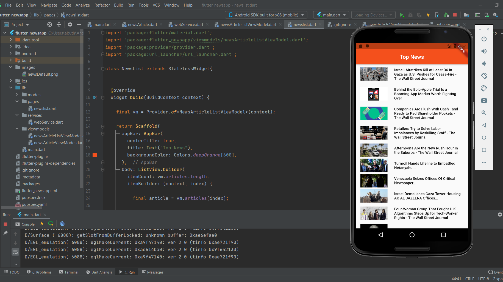

  

  <h3 align="center">Flutter News App</h3>

  

    News Application developed in Dart
     
    Built with http requests and JSON classes and functions
     
     
  

# Table of contents

- [Quick start](#quick-start)
- [Packages used](#packages-used)
- [Structure of Application](#structure-of-application)
- [API Source](#api-source)
- [Creators](#creators)
- [Thanks](#thanks)

# Quick Start

A Flutter project that aims in developing an application that can fetch news data from the internet and display it in a proper format.

# Packages Used

## 1. Https
This Flutter application uses `https` package to fetch data from the internet.

Documentation : [https] (https://pub.dev/packages/http)

The `https` package has functions like `get()` which can get data from the url specified.

## 2. Provider
The Provider package helps in updating/re-loading of resources whenever the main function is updated with data.

Documentation : [provider] (https://pub.dev/packages/provider)

`ChangeNotifier` class has been used to provide change notification in the application where necessary.

## 3. Url launcher
This Flutter plugin helps to load urls either in browser or the application itself.

Documentation: [url_launcher] (https://pub.dev/packages/url_launcher)

# Structure of Application
The application has a few major sections:

1. `lib` : contains the main files and resources of the application.

   a. `models` : contains `newsArticle` class that initializes JSON data into objects.

   b. `pages` : contains `newslist` class that serves as main UI of the application and receives data and displays it in proper format.

   c. `services` : contains `webService` class that parses data from news API url, decodes received JSON body and then maps it to a list.

   d. `viewmodels` : contains `newsArticleListViewModel` and `newsArticleViewModel` classes that contain the model of the JSON data provided in    the url and functions to return the data.

   e.`main.dart` : main class of the application that returns the `newslist` class. 

2. `images` : contains the `newsDefault` image, that is displayed in case a news article fails to recieve any imageUrl.

3. `pubspec.yaml` conatains all the dependencies and assests required in the application.

# API Source
The following website was used to generate an API key: [News API Website ](https://newsapi.org/)

# Creators

**Abhinav Gupta**
   - <https://github.com/abuthegr8>

# Thanks

Thanks to all contributors and their support.

